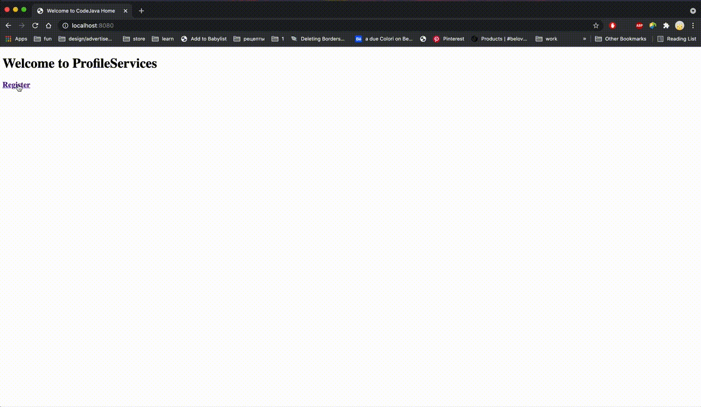

# Profile Services

Simple RESTful Web Service for user profile creation/update. 
In this project I've created Resource Representation Class, Resource Controller and Error handler classes and made fake repository (simple java class) for storing data. I’ve made REST API which provide methods for finding, creating and updating existing users profile with json responses.

## Libraries used in this project
- Spring Boot web.
- Thymeleaf as template engine
- HTML 5 and Bootstrap 4 for responsive user interface

## Demo 

